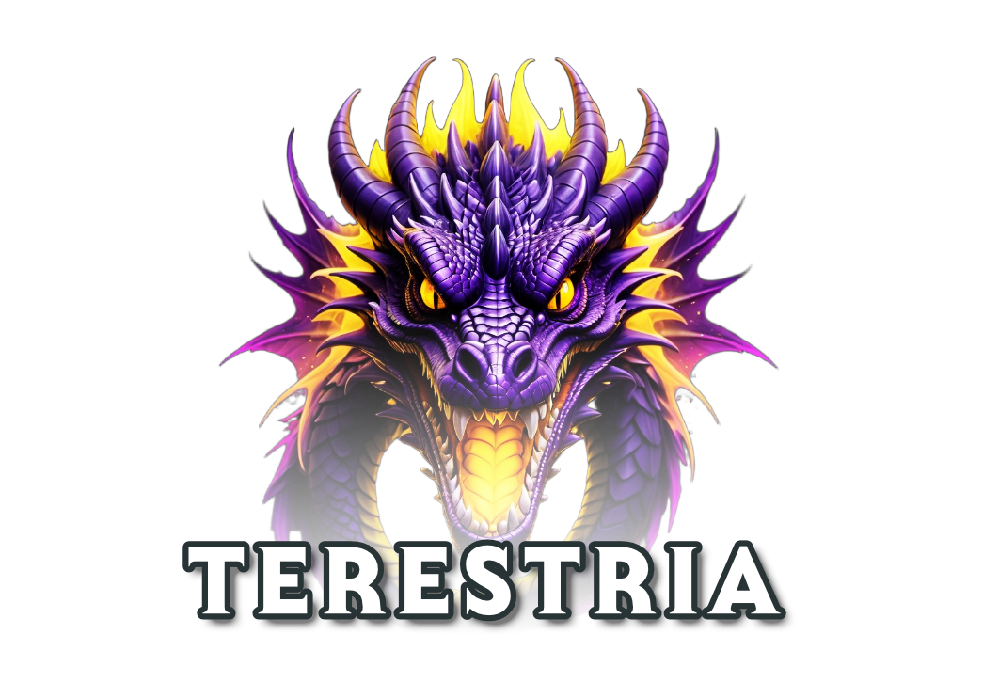

<div align="center">
    


</div>

---

This is the server component of *Terestria*, a 2D game platform tailored for building and hosting small-scale online multiplayer role-playing games.

The server is written in [Golang](https://golang.org/dl/) and utilizes its robust concurrency model to deliver efficient and scalable networking capabilities.

## Build Instructions

### Clone the repository
```bash
git clone https://github.com/guthius/terestria-server.git
cd terestria-server
```

### Install Go

Ensure that [Go](https://golang.org/dl/) is installed on your system. The minimum required version of Go is 1.23.

You can verify the installation by running:
```bash
go version
```

### Build the server

Navigate to the server directory and build the server:
```bash
go build -o ./bin/
```

### Run the server

Execute the built server binary:
```bash
cd ./bin
./terestria-server
```

## License

This project is licensed under the MIT License. For the complete license text, please refer to the [LICENSE](LICENSE) file.